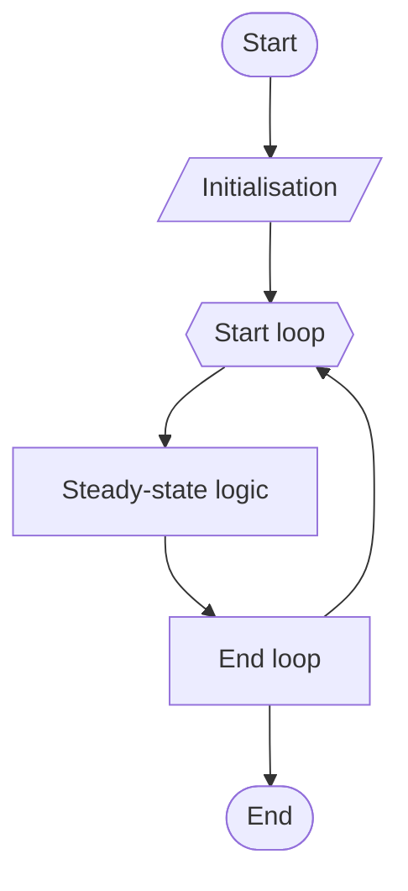
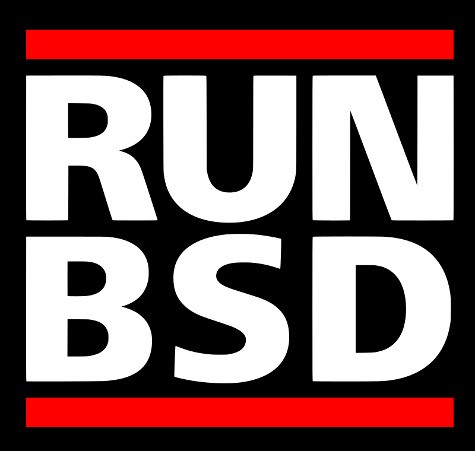

---
# You can also start simply with 'default'
theme: default
# some information about your slides (markdown enabled)
title: Welcome to Slidev
info: |
  ## Slidev Starter Template
  Presentation slides for developers.

  Learn more at [Sli.dev](https://sli.dev)
# https://sli.dev/features/drawing
drawings:
  persist: false
# slide transition: https://sli.dev/guide/animations.html#slide-transitions
transition: malcolm
# enable MDC Syntax: https://sli.dev/features/mdc
mdc: true
---

# Malcolm Still

- 🧑‍💻 Senior Software Engineer @ Swordbreaker
- 🦀 Paid to write rust for 5 years

---
# Slide to give story hook
layout: center
---


# An interesting thing happened recently...


---
# This should be more frontmatter
layout: center
---

# The crab and the pufferfish

Applying OpenBSD's Secure Software Design Pattern in Rust

<!-- <div @click="$slidev.nav.next" class="mt-12 py-1" hover:bg="white op-10">
  Press Space for next page <carbon:arrow-right />
</div> -->

<!-- <div class="abs-br m-6 text-xl">
  <button @click="$slidev.nav.openInEditor()" title="Open in Editor" class="slidev-icon-btn">
    <carbon:edit />
  </button>
  <a href="https://github.com/slidevjs/slidev" target="_blank" class="slidev-icon-btn">
    <carbon:logo-github />
  </a>
</div> -->

<!--
The last comment block of each slide will be treated as slide notes. It will be visible and editable in Presenter Mode along with the slide. [Read more in the docs](https://sli.dev/guide/syntax.html#notes)
-->

---
# Slide to talk about rust background
layout: center
---

# Rust

Talk assumes familiarity with rust

---
# Facts about OpenBSD
# layout: center
---

# OpenBSD

- Unix-like operating system
- Specifically a BSD
  - See also: FreeBSD, NetBSD
- Forked from NetBSD in 1995
- Security focussed
- https://www.openbsd.org/innovations.html
  - privdrop
    - [pledge(2)](https://man.openbsd.org/pledge.2) 2015
    - [unveil(2)](https://man.openbsd.org/unveil.2) 2018
  - privsep

<!--
Question: who uses BSD?

- PlayStation 4 and PlayStation 5 run versions of FreeBSD
- macos takes some components from BSD
!-->

---
# Slide to introduce privdrop
# layout: center
---

# Privdrop

- Basic idea: process starts with some high privilege and lowers itself to some less privileged state
- Classic approach: change user running process
  - E.g. process starts as `root` (uid = 0) then subsequently lowers itself to some other user `alice` (uid = 6001)
- OpenBSD introduced two new primitives
  - pledge
  - unveil
- Much more granular and therefore much more powerful (in terms of security)
- Both scoped to processes

---
# Describe pledge
# layout: center
---

# pledge syscall

Opts in to only allowing certain syscalls

Signature
```c
int
pledge(const char *promises, const char *execpromises);
```

Examples
```c
pledge("stdio rpath wpath", "");
pledge("stdio", "");
pledge("", "");
```

- Note we can, an likely will, call pledge multiple times
- Each time will restrict promises
- What are promises?
  - Bundles of syscalls
  - What decides which syscalls are part of which promise?
    - OpenBSD team audited existing code and used engineering judgement to bin the complete syscall space into the different promises
    - May not be perfect but it is pragmatic
- Making a syscall that is not in one of our current level of promises will cause the kernel to (unceremoniously) kill our process

---
# Slide for describing unveil
layout: center
---

# unveil

Hides parts of the filesystem from our program.

Example

```c
unveil("/etc/resolv.conf", "rw");
unveil(NULL, NULL);
```

- Any attempt to access a file not in the set of unveil calls will fail with not found
- Final `unveil(NULL, NULL)` is where filesystem hiding takes effect
- Again, applies to the current process

---
# Program structure
layout: center
---

# program structure



<!-- 
Idea: we can do a number of pledge calls during the initialisation phase of the program as we bring up the program state.
Similalry we can do a single unveil set before hitting the stead-state loop

Admission: and this is where my ignorance was...like yeah it's cool that we can opt of out of various syscalls and parts
of the file system, but in some arbitrarily complicated program can I actually get to the point where I'm omitting enough
syscalls that a bug in my program isn't still game over. And this is because I actually did not understand the pattern.
!-->

---
# Test
layout: center
---

# Actual structure

- Multiple cooperating processes
- We get N "goes" at pledging / unveiling down

---
# Test
layout: center
---

# Privsep

---
# Test
layout: center
---

- Our pledge / unveil primitives apply on the process level
- Separate our overall program into separate subsystems each of which runs as a process
- Set of processes cooperate to provide equivalent of single process
- The different subsystems then can have different pledges and unveil

---
# Test
layout: center
---

# Examples

---
# Test
layout: center
---

# dhcpleased

```
  PID TT  STAT        TIME COMMAND
15709 ??  IU       0:00.31 - /sbin/dhcpleased
33347 ??  Ip       0:00.29 |-- dhcpleased: engine (dhcpleased)
84909 ??  IpU      0:00.42 `-- dhcpleased: frontend (dhcpleased)
```

OpenBSD kindly makes use of [`setproctitle(3)`](https://man.openbsd.org/setproctitle.3) to give subprocesses useful subsystem names (`engine` and `frontend`)

---
# Test
layout: center
---

# smtpd

```
  PID TT  STAT        TIME COMMAND
41810 ??  Ip       0:00.52 - /usr/sbin/smtpd
11124 ??  Ipc      0:00.60 |-- smtpd: crypto (smtpd)
74895 ??  Ipc      0:00.30 |-- smtpd: control (smtpd)
50559 ??  Ip       0:00.31 |-- smtpd: lookup (smtpd)
27218 ??  Ipc      0:00.85 |-- smtpd: dispatcher (smtpd)
13188 ??  Ipc      0:00.80 |-- smtpd: queue (smtpd)
36552 ??  Ipc      0:00.51 `-- smtpd: scheduler (smtpd)
```

---
# Test
layout: center
---

# Cool, but we don't use OpenBSD

---
# Test
layout: center
---

# Sandboxing in other OSes

- FreeBSD capsicum
- Linux seccomp
- NetBSD secmodel_sandbox (seems experimental)

---
# Test
layout: center
---

...but OpenBSD's approach is particularly ergonomic

---
# Test
layout: center
---

# Conclusions

---
# Test
layout: center
---

# Principle of least privilege

As far as your system allows separate privileges and drop privileges

--- 
# Test
layout: center
---


runbsd.info
